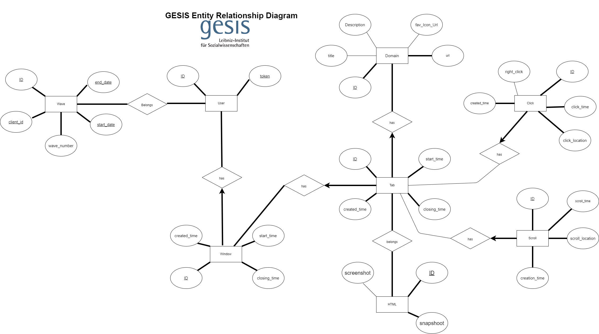

<div align="center">
<table><tr><td bgcolor="white" style="padding: 20px;">
  
</td></tr></table>

# GESIS Surf Backend

**A Django-based backend for web tracking research services**

[](https://www.python.org/)
[](https://www.djangoproject.com/)
[](https://www.postgresql.org/)
[](https://www.docker.com/)
[](LICENSE)

[Features](#features) •
[Installation](#installation) •
[Usage](#usage) •
[API Documentation](#api-documentation) •
[Contributing](#contributing) •
[License](#license)

</div>

---

## 📖 Overview

GESIS Surf Backend is the server-side component of the GESIS Web Tracking project, designed to collect and manage browsing behavior data for social science research. Built with Django REST Framework, it provides a robust API for browser extension integration.

## ✨ Features

- 🔐 **Secure Authentication** - Token-based user authentication
- 📊 **Data Collection** - Track windows, tabs, domains, clicks, scrolls and HTMLs
- 🔄 **Real-time Processing** - Celery-powered async task queue
- 🔍 **Elasticsearch Integration** - Fast and scalable search capabilities
- 📈 **Monitoring** - ELK stack for logging and visualization
- 🐳 **Docker Ready** - Full containerized deployment

## 🏗️ Architecture

```
┌─────────────────┐     ┌─────────────────┐     ┌─────────────────┐
│  Browser Ext.   │────▶│   Django API    │────▶│   PostgreSQL    │
└─────────────────┘     └─────────────────┘     └─────────────────┘
                               │
                               ▼
                        ┌─────────────────┐
                        │  Celery/Redis   │
                        └─────────────────┘
                               │
                               ▼
                        ┌─────────────────┐
                        │  Elasticsearch  │
                        └─────────────────┘
```

## 📋 Requirements

- Python 3.10+
- Docker & Docker Compose
- PostgreSQL 13+
- Redis 7+
- Elasticsearch 7.x

## 🚀 Installation

### Using Docker (Recommended)

1. **Clone the repository**
   ```bash
   git clone https://github.com/geomario/gesis_surf_backend.git
   cd gesis_surf_backend
   ```

2. **Create environment file**
   ```bash
   cp .env.example .env
   # Edit .env with your configuration
   ```

3. **Build and start services**
   ```bash
   docker-compose up -d --build
   ```

4. **Run migrations**
   ```bash
   docker-compose run --rm app sh -c "python manage.py migrate"
   ```

5. **Create superuser**
   ```bash
   docker-compose run --rm app sh -c "python manage.py createsuperuser"
   ```

### Local Development

1. **Clone the repository**
   ```bash
   git clone https://github.com/geomario/gesis_surf_backend.git
   cd gesis_surf_backend
   ```

2. **Install Poetry** (if not already installed)
   ```bash
   curl -sSL https://install.python-poetry.org | python3 -
   ```

3. **Install dependencies**
   ```bash
   poetry install
   ```

4. **Activate virtual environment**
   ```bash
   poetry shell
   ```

5. **Set up environment variables**
   ```bash
   cp .env.example .env
   # Edit .env with your configuration
   ```

### Useful Poetry Commands

| Command | Description |
|---------|-------------|
| `poetry install` | Install all dependencies |
| `poetry install --with dev` | Install with dev dependencies |
| `poetry add <package>` | Add a new dependency |
| `poetry add --group dev <package>` | Add a dev dependency |
| `poetry update` | Update all dependencies |
| `poetry shell` | Activate virtual environment |
| `poetry run <command>` | Run command in virtual environment |

## 💻 Usage

### Running the Application

```bash
# Start all services
docker-compose up -d

# View logs
docker-compose logs -f app

# Stop services
docker-compose down
```

### Common Commands

| Command | Description |
|---------|-------------|
| `docker-compose run --rm app sh -c "python manage.py test"` | Run all tests |
| `docker-compose run --rm app sh -c "python manage.py test APP_NAME"` | Run specific app tests |
| `docker-compose run --rm app sh -c "python manage.py makemigrations"` | Create migrations |
| `docker-compose run --rm app sh -c "python manage.py migrate"` | Apply migrations |
| `docker-compose run --rm app sh -c "flake8"` | Run linting |

### Access Points

| Service | URL |
|---------|-----|
| API | http://localhost:8000/api/ |
| Admin | http://localhost:8000/admin/ |
| API Docs | http://localhost:8000/api/docs/ |
| Flower (Celery) | http://localhost:5555/ |
| Kibana | http://localhost:5601/ |
| PgAdmin | http://localhost:5050/ |

## 📚 API Documentation

Interactive API documentation is available via **drf-spectacular**:

- **Swagger UI**: `http://localhost:8000/api/docs/`
- **OpenAPI Schema**: `http://localhost:8000/api/schema/`

### Key Endpoints

| Endpoint | Method | Description |
|----------|--------|-------------|
| `/api/user/` | POST | User registration |
| `/api/user/token/` | POST | Obtain auth token |
| `/api/window/` | GET, POST | Window management |
| `/api/tab/` | GET, POST | Tab tracking |
| `/api/domain/` | GET | Domain information |
| `/api/clicks/` | POST | Click events |
| `/api/scrolls/` | POST | Scroll events |

## 🗃️ Database Design

### Entity Relationship Diagram



### Key Relationships

| Relationship | Type | Description |
|--------------|------|-------------|
| User ↔ Wave | Many-to-Many | Users participate in research waves |
| User → Window | One-to-Many | Users have multiple browser windows |
| Window → Tab | One-to-Many | Windows contain multiple tabs |
| Tab → Domain | Many-to-One | Tabs belong to domains |
| Tab → Click | One-to-Many | Tabs record click events |
| Tab → Scroll | One-to-Many | Tabs record scroll events |

## 🧪 Testing

```bash
# Run all tests
docker-compose run --rm app sh -c "python manage.py test"

# Run with coverage
docker-compose run --rm app sh -c "coverage run manage.py test && coverage report"

# Run specific test
docker-compose run --rm app sh -c "python manage.py test core.tests.test_models"
```

## 🤝 Contributing

We welcome contributions! Please see our **[Contributing Guide](CONTRIBUTING.md)** for detailed information on:

- 🌿 **Branching Strategy** - `dev` → `main` → `prod` workflow
- 📝 **Commit Conventions** - Using Commitizen with Conventional Commits
- 🔍 **Code Quality** - Pre-commit hooks, linting, and formatting
- 🔀 **Pull Request Process** - Guidelines and review workflow

### Quick Start

1. **Fork the repository**
2. **Create a feature branch** from `dev`
   ```bash
   git checkout dev && git pull origin dev
   git checkout -b feature/amazing-feature
   ```
3. **Install pre-commit hooks**
   ```bash
   poetry install
   poetry run pre-commit install
   ```
4. **Commit using Commitizen**
   ```bash
   git add .
   poetry run cz commit
   ```
5. **Push and open a Pull Request** targeting `dev`

## 📄 License

This project is licensed under the MIT License - see the [LICENSE](LICENSE) file for details.

## 📝 Citing

If you use this software in your research, please cite:

```bibtex
@article{ramirez2025gesis,
  title = {GESIS Surf },
  author = {Ramirez, Mario and },
  journal = {SoftwareX},
  volume = {XX},
  pages = {XXXXXX},
  year = {2026},
  publisher = {Elsevier},
  doi = {10.1016/j.softx.2025.xxxxxx}
}
```

See [CITATION.cff](CITATION.cff) for more citation formats.

## 👥 Authors

- **Mario Ramirez** - *Lead Research Software Engineer* - [@geomario](https://github.com/geomario) [@MarioGesis](https://www.gesis.org/en/institute/about-us/staff/person/mario.ramirez)
- **Fernando Guzman** -*Software Architect Consultant* - [@Fernando](https://www.linkedin.com/in/fernando-guzman-9262801b/)

## 🙏 Acknowledgments

- [GESIS - Leibniz Institute for the Social Sciences](https://www.gesis.org/)
- [Computational Social Science Department](https://www.gesis.org/en/institute/about-us/departments/computational-social-science)

## 📧 Contact

Questions or feedback? Reach out!

- **Email**: mario.ramirez@gesis.org
- **GitHub Issues**: [Create an issue](https://github.com/geomario/gesis_surf_backend/issues)

---

<div align="center">
Made with ❤️ at GESIS
</div>